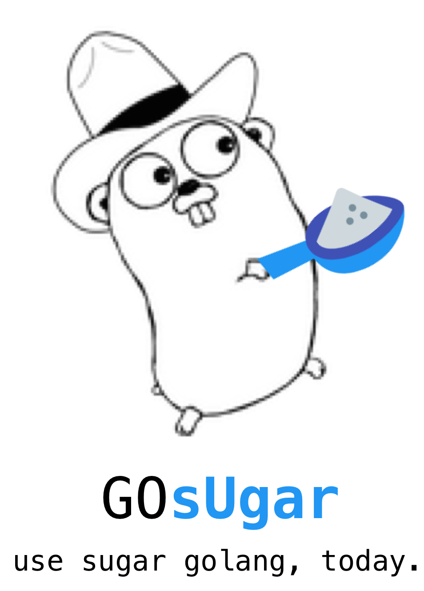

## **GOsUgar** 🍬

> GoCn 2017 goHackathon
>
> Make Golang Sugar Again.


> ⚠️Waring: 本项目还在施工🚧中，目前处于玩具🔫状态




Golang 语法糖 管理工具

## 愿景

希望作为一个类 babel 于 js 的工具。 GOsUgar 期望通过标准化，流程化，插件化，一种基于 golang ast + golang generate + golang comment的轻量级无侵入的扩展 Golang 语法**管理工具**。

// 又一个包管理工具 😓

GOsUgar 作为一个尝试，未来从而通过对 AST 的扩充，形成一门代码精简，可读性强的 Go 方言 GOU。

## TODO

- [x] Sugar-question-mask [ 一种优雅的 err != nil ]
- [ ] Sugar-string-format [两种优雅的字符串格式化 ]
    - 基本完成
- [ ] Sugar-decorator [ @Decorator ]
    - 难产中......
- [ ] Sugar-generics [ 范式支持 ]
    - 选型中......
- [ ] Sugar-operators [运算符重载]
    - base on https://github.com/jessevdk/go-operators

## 什么？ Golang 还有语法糖

是的 你没有看错。虽然这个语法糖基于 comment。

以下是几个简单的例子

例如:

## Sugar-question-mask

一种优雅的 error != nil

```
Sugar-question-mask-0.go
// try err
{
  ......
  return err
}
```


```
Sugar-question-mask-1.go
// ? err
{
  ......
  return err
}
```

#### 转换后

```
target.go
// ? err
if err != nil {
  ......
  return err
}
```


## Sugar-string-format

两种优雅的字符串格式化

```
apple := "Golang China Foundation"
pen := "PingCAP"
slogan := `${apple} x ${pen}`
print(slogan)
println("${apple} x ${pen}".format(apple, pen))
```

#### 转换后

```
apple := "Golang China Foundation"
pen := "PingCAP"
slogan := fmt.Sprintf("%s x %s",apple, pen)
println(slogan)
println(fmt.Sprintf("%s x %s",apple, pen))
```


## Sugar-decorator

```
// @ required_login arg0 arg1
func admin(...){
  {detail}
}
```

#### 转换后

```
等效于
func admin_decorator_0(){
  {detail}
}

func admin(...){
  required(arg0, arg1, admin_decorator_0) 
}
```


# GOsUger quickstart

```
gosuger -f suger.yml /path/to/your/project

- [ ] Sugar-question-mask [ 一种优雅的 err != nil ]
- [ ] Sugar-string-format [两种优雅的字符串格式化 ]
      - 基本完成
- [ ] Sugar-decorator [ @Decorator ]
      - 难产中......
- [ ] Sugar-generics [ 范式支持 ]
      - 选型中......
- [ ] Sugar-operators [运算符重载]

```

```
suger.yml

plugins:
  - suger-question-mask
  - suger-string-format
  - suger-decorator
  - github.com/joeshaw/gengen@latest
project:
  - /<package_name>/*
  - /<package_name>/a/*/b.go
  ...
```


## 团队

GOsUgar 目前就一个工作中用 Python，个人项目 90% 用 Python ，痴迷效率，懒驱动开发，节约时间玩吃鸡的,迷恋 Python 的高效和简洁。又想要 Golang 的并发友好和性能的弱鸡程序猿— wph95


## 参考和启发

https://github.com/riolet/rix

https://github.com/jessevdk/go-operators

[todo]